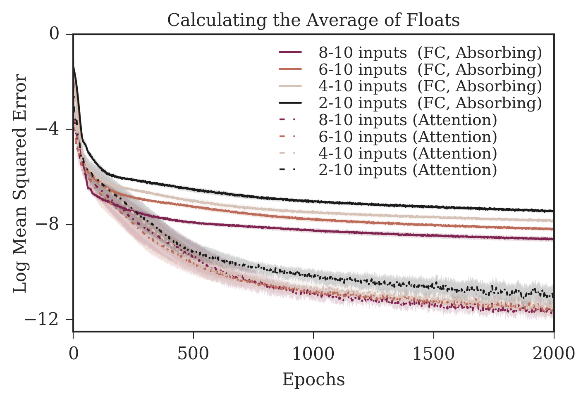

# MA-POCA
**Multi-Agent POsthumous Credit Assignment** (MA-POCA) is a multi-agent learning algorithm that can gracefully deal with spawning and despawning agents without the use of absorbing states.

You can check the original paper [here](todo-link-to-paper).

## Average calculation with absorbing states

This [notebook](AverageCalculationWithAbsorbingStates.ipynb) can be used to generate some of the plots of the paper (Figure 1 and Appendix A).



## Reproduce RL experiments

### Installation

To install the code for training, in the ma-poca folder, run the command:

```
pip install -e mapoca/
```

The mapoca package functions similarly to the mlagents package (see [here](https://github.com/Unity-Technologies/ml-agents/tree/release_18/ml-agents) for more information)

To launch an experiment, use the command :

```
mapoca-learn config/<algorithm>/<env_name>.yaml --env=<env_name> --run-id=<test-id>
```

where:
 -  `<env_name>` is the name of one of our four environments:
    - BatonPass
    - DungeonEscape
    - ParticlesEnv
    - PushBlockCollab
 - `<algorithm>` can be one of the three provided algorithms:
    - mapoca
    - coma
    - ppo 
 - and  `<test-id>` a unique identifier for the experiment

The results of the experiment will be inside the `results` folder.

  
